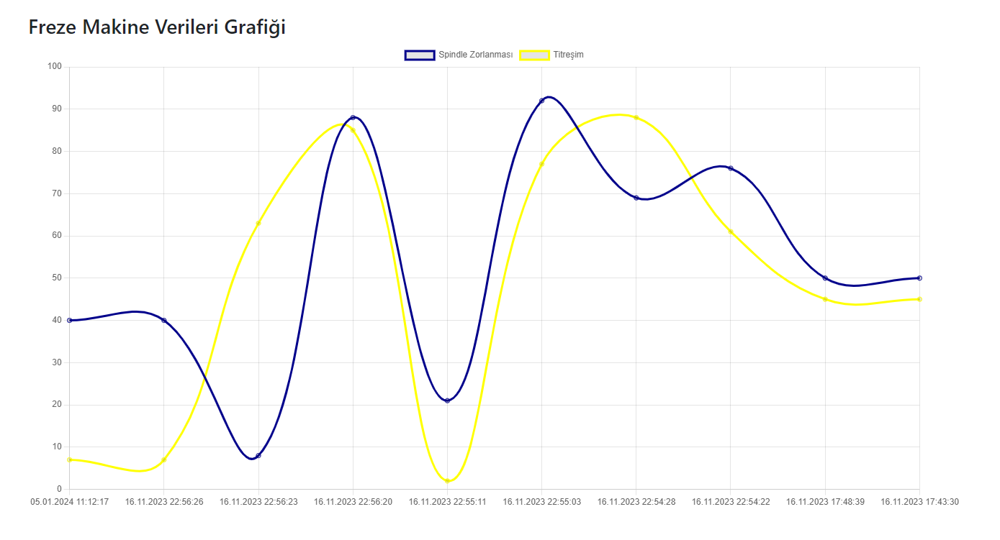

# Makine Parçası Üretim Uygulaması
İçerisinde CNC, CNC Torna, Eksantrik Pres, Tel erezyon, Freze ve Hidrolik Pres bulunan bir sanayi kuruluşuna hazırlanmış örnek bir uygulama.

Uygulamanın temel amacı faaliyette olan makinelerin bakım, onarım maliyetlerini minimize etmek amacıyla makinelerden toplanan çeşitli verilerin makinenin optimal çalışma eşik değerleri ile karşılaştırılması, olası eşik değer aşımlarında tablo üzerinde eşik değerin aşıldığı makineyi uyarı vererek göstermesi, ayrıca bu eşik değer aşımı ile ilgili rapor oluşturarak raporda değerin aşıldığı zaman, hangi değerin aşıldığı gibi açıklamaları içeren açıklama metinleri ile veri tabanı kayıtları yapılarak bu raporları günlük olarak tablolarda göstermesidir. 

Makinenin sağlıklı çalışması için gerekli olan eşik değerin üzerine çıkıldığında kullanıcı tablo üzerinden gerekli makineyi kapatarak güvenliği sağlayabilir. Ayrıca olası bir tehlike durumunda tüm makineleri durdurabilir.

Tablo üzerinden her makine için yeni eşik değerler belirleyerek yeni ölçümlerin bu değerler üzerinden yapılmasını sağlayabilir. 

İstenildiği durumlarda manuel ölçümler alarak makineler kontrol edilebilir.

## Makineler
- CNC
- CNC Torna
- Eksantrik Pres
- Tel Erezyon
- Freze
- Hidrolik Pres

Uygulama Front-End tarafında React.js kütüphanesi ile Back-End tarafında ise Node.js ile geliştirilmiştir.
Uygulama verileri ilişkisel veri tabanı olan MySQL'de tutulmaktadır.

## Bağımlılıklar
React.js ve Node.js Bağımlılıkları şu şekildedir;
- Bootstrap (Tasarım için kullanılmıştır.)
- Material UI (Tasarım için kullanılmıştır.)
- Redux Toolkit (State Management için kullanılmıştır.)
- Chart.js (Uygulama içerisindeki grafikler bu bağımlılık ile oluşturulmuştur.)
- Express (Back-End tarafında server Express ile oluşturulmuştur.)
- React Hot Toast (Kullanıcıya ulaştırılan bildirimler bu bağımlılık ile oluşturulmuştur.)
- SASS (Tasarım için kullanılmıştır.)
- Axios (Back-End ile iletişim Axios ile sağlanmıştır.)
- Body Parser (Back-End tarafındaki verilerin işlenmesi sürecinde kullanılmıştır.)
- Nodemon (Geliştirme aşamasında serverin sürekli ayakta kalması için kullanılmıştır.)
- MySQL2 (Veri tabanına erişim amacıyla kullanılmıştır.)
- Cors  (Veri tabanına erişim izinlerinin yönetilmesi amacıyla kullanılmıştır.)
- Dot Env  (Veri tabanına erişim bilgilerinin tutulması amacıyla kullanılmıştır.)

## Server Durumu Göstergesi
Serverin sorunsuz şekilde çalışır durumda olup olmadığının kontrol edildiği ikondur. Bu ikon yeşil olduğunda serverin sorunsuz çalıştığını göstermektedir. Kırmızı olduğunda ise serverin çalışması sırasında hatalar alındığını göstermektedir. Bu hatalar arasında MySQL bağlantısının kurulduğunun kontrolü de yer almaktadır.

## Makine Verileri Tablosu
Makine Verileri Tablosu içerisinde makinenin adı, makinenin çalışma durumu, son değer ölçüm zamanı, spindle sıcaklığı, spindle zorlanması, sıcaklık, titreşim, automatic gibi veriler kullanıcıya makinenin durumu hakkında bilgilendirme sağlayacak şekilde tasarlanmıştır. Ayrıca içerisinde bulunan butonlar yardımı ile makinelerin tamamı durdurulabilir, yeni ölçüm değerleri alınabilir, test amaçlı tüm veriler rastgele şekilde değiştirilebilir.

- Makine Çalışma Durumu
- Son Değer Ölçüm Zamanı
- Spindle Sıcaklığı
- Spindle Zorlanması
- Sıcaklık
- Titreşim
- Automatic

## Yeni Ölçümlerin Alınması
Belirli periodlarla makine verilerinin ölçülmesinin dışında kullanıcı manuel olarak makine değerlerini güncellemek istediğinde yeni ölçümler yaparak değerleri güncelleyebilir.

## Tüm Makine Verilerini Rastgele Değiştirilmesi (Test)
Makine eşik değerlerinin doğru şekilde uyarı verdiğinden emin olmak adına tüm değerler test amaçlı değiştirilip kontrol edilebilir.

## Tüm Makinelerin Durdurulması
Olası tehlike durumlarında önlem amaçlı tüm makineleri kapatacak bir buton bulunmaktadır.

## Eşik Değerler Tablosu
Makinelerin optimal çalışma koşullarına uygun olarak hazırlanan eşik değerlerin gösterildiği tablodur.

## Eşik Değer Belirleme
Makinelerin çalışma değerlerinde yapılacak güncellemeler için oluşturulmuş alandır. Sadece makineyi seçerek o makineye ait eşik değerleri değiştirebilirsiniz.

## Makine Hata Raporları
Eşik değerlerin üzerine çıkıldığı durumlarda duruma ilişkin sensör verisi, hata zamanı gibi değerlerin açıklamaları ile birlikte veri tabanına yapılan kayıtların gösterildiği tablodur.

## Günlük Ölçüm Sonuçları
Gün içerisindeki yapılan manuel ölçümlerin yer aldığı tablodur.

## CNC Makine Verileri Grafiği
CNC Makinesinin ölçülmüş verilerini grafik halinde gösteren bölümdür.

## CNC Torna Makine Verileri Grafiği
CNC Torna Makinesinin ölçülmüş verilerini grafik halinde gösteren bölümdür.

## Eksantrik Pres Makine Verileri Grafiği
Eksantrik Pres Makinesinin ölçülmüş verilerini grafik halinde gösteren bölümdür.

## Tel Erezyon Makine Verileri Grafiği
Tel Erezyon Makinesinin ölçülmüş verilerini grafik halinde gösteren bölümdür.

## Freze Makine Verileri Grafiği
Freze Makinesinin ölçülmüş verilerini grafik halinde gösteren bölümdür.

## Hidrolik Pres Makine Verileri Grafiği
Hidrolik Pres Makinesinin ölçülmüş verilerini grafik halinde gösteren bölümdür.

